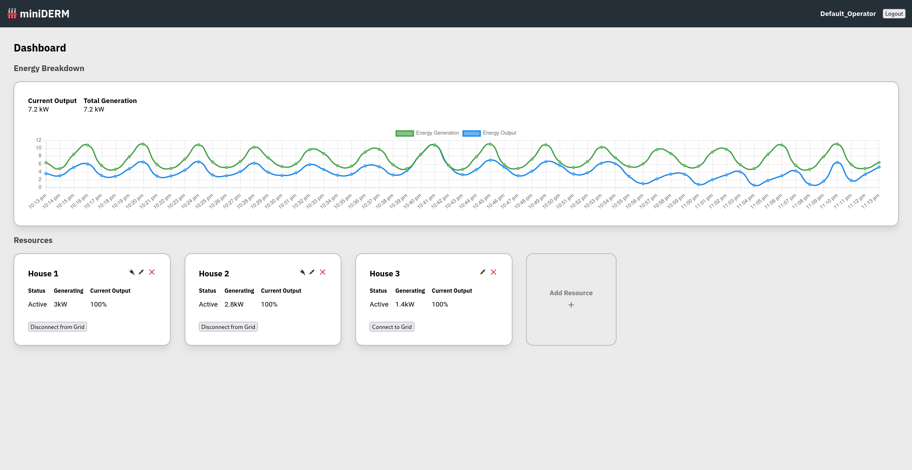

# miniDERM
Create and manage simulated energy generation resources in a snappy and simple web UI.



# Stack

This project is quite light, it currently uses:
- .NET 7 Minimal Web API
- Orleans
- Svelte
- ChartJS
- Docker

The back-end server is hosting an Orleans Silo and does not persist data.

The front-end is a statically generated Svelte app, the index.html is served by the .NET web API.

# Running miniDERM

## Option 1: Build it Yourself

### Build and Tag the application

Clone this project and `cd` into the root of the repo. Execute the following in your console:

```
> docker build -t miniderm .
```

This will build the front and back halves of the application and combine them into a single image.

### Start the application
When built, the app can be run by executing:

```
> docker run -p 5000:5000 miniderm
```

To access the Web UI you can visit [http://localhost:5000](http://localhost:5000).

## Option 2: Pull Image from GitHub Container Registry

If you'd prefer to not build the image from source, versions of `miniderm` live in the GitHub Container Registry.

### Run with Docker

You should be able to run the latest image by executing:

```
> docker run -p 5000:5000 ghcr.io/aaronl1011/miniderm
```

Or specify a version with:
```
> docker run -p 5000:5000 ghcr.io/aaronl1011/miniderm:<version>
```

# Requirements

### Functional

- As a user, I want to be able to see the current status of my energy generation, so that I can understand how much energy I have.
- As a user, I want to see the current energy output of my resources, so that I can understand how much energy is being sent back to the grid.
- As a user, I want to be able to set the current energy output of my resources, so that I can control how much energy I am discharging into the grid.
- As a user, I want to be able to connect and disconnect my energy resources from the grid, so that I can control when my resources are discharging into the grid.

### Non-functional
- The app uses Websockets to provide real-time-ish information to the UI.
- The app can hold state in memory, it doesn’t need to persist through reloads, but it should be designed in a way where the persistence provider can be easily swapped out.
- The app can scale easily to support growth of operators and energy providers.
- When functionally complete, the app should be containerised, easily distributable and easily executable.


# Domain Entities

### Operator

```csharp
public interface IOperatorGrain : IGrainWithStringKey
{
    Task<Guid> AddEnergyResource();
    Task RemoveEnergyResource(Guid resourceId);
    Task<IEnergyResourceGrain?> GetEnergyResource(Guid resourceId);
    Task<int> GetEnergyResourceCount();
    Task<ResourceInfo[]> GetEnergyResourceInfo();
    Task<EnergyTimestamp[]> GetEnergyHistory();
}
```

### EnergyResource

```csharp
public interface IEnergyResourceGrain : IGrainWithGuidKey
{
    Task Activate();
    Task Deactivate();
    Task<string> GetStatus();
    Task SetEnergyOutput(double output);
    Task<double> GetEnergyOutput();
    Task<double> GetEnergyGeneration();
    Task<EnergyTimestamp[]> GetEnergyGenerationHistory();
    Task ConnectToGrid();
    Task DisconnectFromGrid();
    Task<bool> IsConnectedToGrid();
    Task SetOwner(string operatorName);
    Task<string> GetOwner();
    Task SetName(string name);
    Task<string> GetName();
    Task<ResourceInfo> ToDTO();
}

```

# Scope

**Authentication & Authorization:** We can assume we will be given a value in all requests related to an Operator name, I dont want to worry about a true auth implementation for this project as it could be integrated later (ie sourcing operator identity & scoping access with JWTs).

**Monitoring and Logging:** No monitoring necessary for initial release, although at some point Prometheus and OpenTelemetry would be lovely. For now, standard runtime logging should suffice to see if anything explodes.

### Architecture Overview

1. **Web API Layer:** We'll create a web API using ASP.NET Core, exposing endpoints for managing both users and energy resources. These endpoints will be responsible for interacting with the Orleans grains.
2. **Orleans Layer:** The Orleans framework will be utilized to implement the Actor model, following the provided interfaces for `IOperatorGrain` and `IEnergyResourceGrain`. We'll configure Orleans for high-concurrency and low-latency.
3. **In-Memory Persistence:** Initially, we'll use in-memory storage for state persistence. We'll structure this in a way that it can be swapped out with a different provider in the future.
4. **Containerization:** We'll Dockerize the application using a multi-layered image to separate dependencies and application code

### Development Plan

1. **Implement Orleans Grains:** We'll start by implementing the provided grain interfaces and simulating the energy resource management logic.
2. **Build Web API:** Next, we'll create the web API endpoints that interact with the Orleans grains.
3. **Build Frontend:** We need to create some UI to interact with the system. Might be able to get clever with svelte and static site generation, as the UI won’t need to be very complex.
4. **Dockerize the Application:** We'll create a Dockerfile to containerize the application. Hopefully this will keep the final executable lightweight and easy to distribute & run!
5. **Host it Somewhere:** I'd like for the image to be readily available at some point, so others can just run without needing to clone the project and build it themselves.